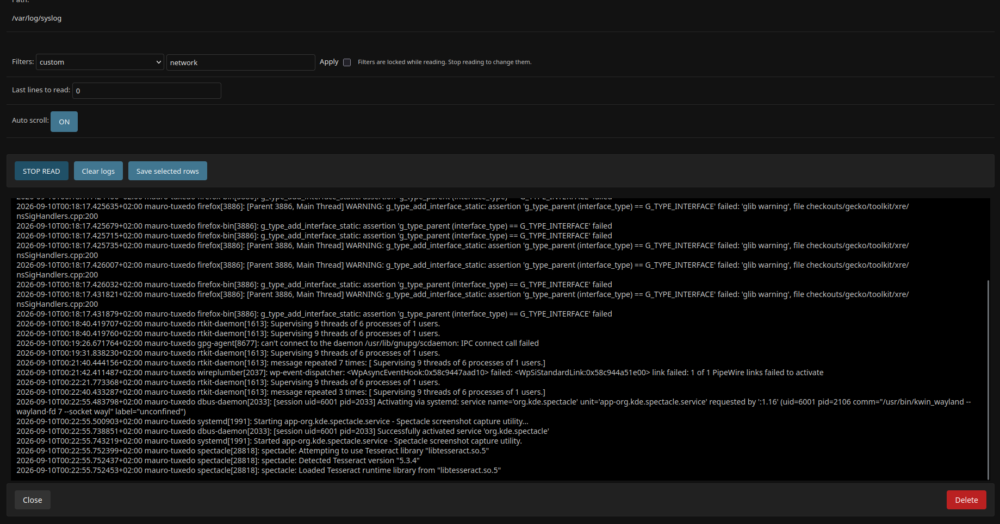

=================================
Django LogTailer
=================================

:Version: 2.0
:Source: http://github.com/fireantology/django-logtailer/

Allows the viewing of any log file entries in real time directly from the Django admin interface.
It allows you to filter on logs with regex and offer also a log clipboard for save desired log lines to the django db.

Demos
========

- Demo `Video`_

.. _`Video`: http://www.vimeo.com/28891014

Requirements
=============

- Django >= 6.1.1
- Python >= 3.12
- Sessions enabled

Installation
============

- Install the package with pip install django-logtailer
- Add it to the INSTALLED_APPS in your SETTINGS
- Set LOGTAILER_ALLOWED_ROOTS in your SETTINGS (see Settings below)
- add to urls.py: url(r'^logs/', include('logtailer.urls')),
- Run manage.py migrate for create the required tables
- Run manage.py collectstatic

Settings
========

``LOGTAILER_ALLOWED_ROOTS`` (mandatory): list of directories log files are
allowed to live in. Paths are fully resolved (symlinks and ``..`` included)
before checking, preventing path traversal (CWE-22). If the setting is
missing or empty, access to every log file is denied::

    LOGTAILER_ALLOWED_ROOTS = ['/var/log/myapp']

Filters
=======

Filters (saved in the admin or typed in the custom filter field) are
`Python regular expressions`_ evaluated server-side with ``re.search()``
against each raw log line. Only matching lines are returned to the browser.

- Write plain patterns, not JavaScript literals: use ``networkmanager``,
  not ``/networkmanager/``.
- Flags are inline groups: case-insensitive matching is
  ``(?i)networkmanager``, not ``/networkmanager/i``.
- An invalid regex falls back to a literal substring match.

.. warning::
   Filters saved with versions before 2.0 were evaluated as JavaScript
   regex literals and may no longer match. Rewrite them in Python syntax,
   e.g. ``/networkmanager/i`` becomes ``(?i)networkmanager``.

.. _`Python regular expressions`: https://docs.python.org/3/library/re.html

Running tests
=============

From the repository root::

    python runtests.py

The suite uses a minimal standalone settings module (``tests/settings.py``)
with an in-memory SQLite database, so no extra setup is needed.
